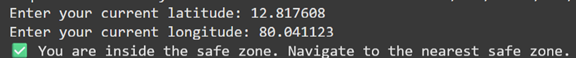
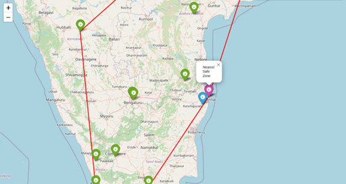

# 🛡️ Safe Zone Detection and Visualization

A geographic safety visualization tool that computes and displays whether a user is inside a "safe zone" polygon formed using **Convex Hull Geometry**. The map is rendered interactively using **Folium** and accepts real-world coordinates.

---

## 🚀 Features

- 🌐 Reads safe zones (latitude & longitude) from file  
- 📍 Asks for real-time user location input  
- 🔺 Computes convex hull boundary around safe points  
- ✅ Checks if the user is inside or outside the zone  
- 🗺️ Generates an interactive HTML map with Folium  

---

## 🧰 Tech Stack

- **Language**: Python 3.x  
- **Libraries**: NumPy, SciPy, Folium, Geopy  
- **Tools**: Google Colab / Local Python  

---

## 📂 Folder Structure

```bash
Safe-Zone-Detection-and-Visualization/
│
├── fetch_data.py           # Reads safe zones and user location
├── convex_hull.py          # Calculates convex hull of given points
├── visualize.py            # Generates the interactive map using Folium
├── main.py                 # Main driver script
├── safe_zones.txt          # Input coordinates (latitude,longitude)
├── safe_zone.ipynb         # Jupyter notebook of the project
└── README.md               # Project documentation
```

## 📷 Screenshots

| Input | Output |
|---------------|----------------------------|
|  |  |


## 📸 How It Works

The system reads GPS coordinates from a text file.
It calculates a convex hull enclosing those points using SciPy.
User inputs their current location.
The system checks if the user lies inside the hull using cross product checks.
A map is created marking safe points, the boundary, and user location.

---

## 🧪 How to Run Locally or in Google Colab

*Clone the repository:*
```bash
git clone https://github.com/yourusername/Safe-Zone-Detection-and-Visualization.git
cd Safe-Zone-Detection-and-Visualization
```
Install dependencies:
```bash
pip install numpy scipy folium geopy
```
Run the program:
```bash
python main.py
```
Or launch safe_zone.ipynb in Jupyter or Google Colab for step-by-step execution.

Open the generated safe_zones_map.html file to view the map in your browser.

🙌 Contributing

Pull requests are welcome! For major changes, please open an issue first to discuss the proposal.
